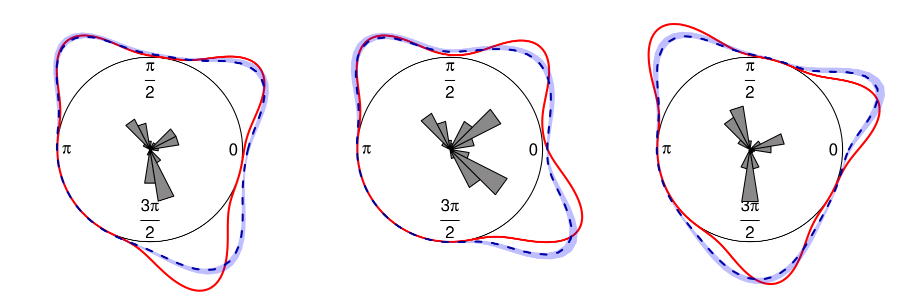

# Bayesian flexible model selection for analyzing linear-circular peak service hours data
In this tutorial we describe the steps for obtaining the results of the wrapped normal example of **Section 4** of the paper **"Bayesian flexible model selection for analyzing linear-circular peak service hours data"**.
First, we load on a clean environment all the required libraries. Also, we load the R script with all the auxiliary functions

```r
rm(list=ls())    # Clean the current session
library(mvtnorm)
library(circular)
library(truncnorm)
source("functions.R")
```

## Data generation
We generate a 1000x3 design matrix with two covariates. Also, we generate a vector with 100 values in the interval [0,2pi] to evaluate the density. Be aware package circular requires to use an object of class circular in its functions, otherwise it will draw warnings repeatedly.

```r
set.seed(1234)
n=1000
x = cbind(rep(1,n),sample(-1:1, n,replace = T),sample(0:1, n,replace = T))
p=seq(0,2*pi,length.out = 100)
ph=circular(p) # POINTS TO PLOT DENSITY
```

Then, we generate from a mixture of wrapped normal distributions with the following coefficients:

```r
#Regression coeffients mixture
b1_og <- c(1.5,2,0) 
b2_og <- c(-0.5,-1.7,0)
b3_og <-c(-3,2.5,0)

# Angles
theta1 <- 2*atan(x%*%b1_og)+pi
theta2 <- 2*atan(x%*%b2_og)+pi
theta3 <- 2*atan(x%*%b3_og)+pi
U=runif(n)
datos=rep(0,n)
for (i in 1:n) {
  w=ifelse(U[i]<=0.4,theta1[i],ifelse(U[i]>0.7,theta3[i],theta2[i])) 
  datos[i]=rwrappednormal(1,circular(w),sd=0.25)
}
```

Notice, only the first covariate is relevant. We have three possible values: 0,1,-1. Thus, we will evaluate the predictive density for the following vectors to compare its theorical density

```r
x1=c(1,0,0)
x2=c(1,1,0)
x3=c(1,-1,0)
```


## Dirichlet process mixture of projected normal distribution with spike-and-slab
### Hyperparameters
We set the hyperparameters for the base measure and the concetration parameter, also we compute the direction vector for the data
```r
# SETTING HYPERPARAMETERS -------------------------------------------------

# NORMAL PRIOR FOR BETA
tau = 100 # VARIANCE NORMAL DISTRIBUTION
np=dim(x)[2]
ph=circular(p)
n=length(datos)
vp=cbind(cos(p),sin(p))
v = cbind(cos(datos),sin(datos))
invtau=1/tau # PRECISION NORMAL DISTRIBUTION
b0_1 = rep(0,np) # PRIOR MEAN FIRST BETA
b0_2 = rep(0,np) # PRIOR MEAN FIRST BETA

delta0 = diag(invtau,np) # PRIOR PRECISION MATRIX 
# GAMMA PRIOR CONCENTRATION PARAMETER DIRICHLET

am=20 # SHAPE
bm=0.1 # RATE
```
### Models
We list the models, in this example there are 8 possibilities.

```r
# POSSIBLE MODELS ----------------------------------------------------------
model = expand.grid(rep(list(c(0,1)), times = np-1))
m = dim(model)[1] # TOTAL NUMBER POSSIBLE MODELS

# MODEL LIST AS MATRIX OF LOGICAL VALUES
model = as.matrix(cbind(rep(1,m),model)) 
dimnames(model) =list(NULL, NULL) # REMOVE NAMES
model = model==1 

```

### Gibbs sampling algorithm

Now we initialitize the Gibbs algorithm, we start with a random number of clusters and sticks generated from the prior using an intial concentration parameter of 2. The initial values of the parameters are also simulated from the prior. Additionaly, we create all the objects necessary to store the results. To exemplify, we fixed the chain size in 10000.

```r
# CHOOSE RANDOM NUMBER OF CLUSTERS --------------------------------------

M = 2 # CONCENTRATION PARAMETER
Ni = rep(0,n) # SIZE OF EACH CLUSTER
vj = rep(NA,100) # STICK BREAKING
wj = rep(NA,100) # WEIGHTS DP

# AUXILIARY VARIABLES
u = runif(n) 
aux =T

for (i in 1:n) {
  while (aux) {
    Ni[i]=Ni[i]+1
    vj[Ni[i]]=rbeta(1,1,M)
    wj[Ni[i]]=vj[Ni[i]]*prod(1-vj[1:Ni[i]-1])
    if(sum(wj[1:Ni[i]])>1-u[i]){aux=F}
  }  
  aux=T
}

# NUMBER OF CLUSTERS
K=max(Ni)
# CREATE OBJECTS TO STORE RESULTS ------------------------------------------

b1j=matrix(NA,ncol = np, nrow = 100) # COEFFICIENTS BETA 1 
b2j=matrix(NA,ncol = np, nrow = 100) # COEFFICIENTS BETA 2
pdi=matrix(NA,nrow = n,ncol=K) # CLUSTER PROBABILITY FOR EACH OBSERVATION
di = rep(NA,K) # CLUSTER MEMBERSHIPS INDICATORS
# STARTING VALUES MCMC ----------------------------------------------------
covM=solve(delta0 + t(x)%*%x) # INITIAL COV MATRIX

b1j[1:K,]= rmvnorm(K, b0_1, covM) # VALUES BETA 1
b2j[1:K,]= rmvnorm(K,b0_2,covM) # VALUES BETA 2

r = rep(0.5,n) # RADIUS 

g1 = model[m,] # MODEL FIRST COMPONENT
g2 = model[m,] # MODEL SECOND COMPONENT
# EVALUATE OBSERVATIONS PROBABILITY
for ( i in 1:K ) {pdi[,i] = dpnorm(datos, mu = c(x[i,]%*%b1j[i,],x[i,]%*%b2j[i,]), sigma = diag(2)) }

# ASSIGN CLUSTER MEMBERSHIPS INDICATORS
for (i in 1:n) {di[i]=sample(K,size = 1,prob = pdi[i,])}
w = womack(np-1,1) # PRIOR PROB MODELS 
prob_mod1=rep(0,m)
prob_mod2=rep(0,m)

# STORE MCMC RESULTS ------------------------------------------------------

num = 10000 # CHAIN SIZE 
samples_g1 = numeric(num) # SELECTED MODELS BETA 1
samples_g2 = numeric(num) # SELECTED MODELS BETA 2
fym1 = matrix(NA,ncol = 100, nrow = num) # STORE DENSITY ESTIMATIONS x1
fym2 = matrix(NA,ncol = 100, nrow = num) # STORE DENSITY ESTIMATIONS x2
fym3 = matrix(NA,ncol = 100, nrow = num) # STORE DENSITY ESTIMATIONS x3

``````
### MCMC 

Now the MCMC will start, the density values and the model indexes are stored for processing afterwards.

```r

for (it in 1:num) {
  
  cat(it, "of ",num ,"\r") # PRINT ITERATION NUMBER
  
  index = sort(unique(di)) # UNIQUE VALUES MEMBERSHIPS
  K = length(index) # NUMBER OF NON-EMPTY CLUSTERS
  pdi = matrix(NA,nrow = n,ncol=K+1) # PROBABILITY CLUSTER FOR EACH OBSERVATION
  Ni = rep(NA,K) # SIZE OF CLUSTERS
  u = rep(NA,n) # LATENT VARIABLE SLICE SAMPLER DIRICHLET PROCESS
  fy1=0 # DENSITY ESTIMATION
  fy2=0 # DENSITY ESTIMATION
  fy3=0 # DENSITY ESTIMATION
  
  ## ADDING AND DELETING PREDICTORS ##
  
  ### NEW ###
  indg1 = sample(size=1,2:np)      
  G=cbind(g1, g2)
  Ga=G
  if (sum(Ga[indg1, ]) > 0) {
    Ga[indg1, ] = c(FALSE, FALSE)
  } else {
    while(1)
    {
      Ga[indg1, ] = replicate(1, sample(c(FALSE,TRUE),replace = T))
      if(sum(Ga[indg1, ]) > 0){break}
    }
  }
  
  
  ###
  
  # LOG LIKELIHOOD NEW PROPOSED MODEL
  total=sum(rowSums(Ga)!=0)
  likN=log(w[total])-.5*sum(Ga[,1])*log(tau)*K-.5*sum(Ga[,2])*log(tau)*K
  # LOG LIKELIHOOD OLD MODEL
  total=sum(rowSums(G)!=0)
  likO=log(w[total])-.5*sum(G[,1])*log(tau)*K-.5*sum(G[,2])*log(tau)*K
  
  ga1=Ga[,1]
  ga2=Ga[,2]
  ####
  
  for (i in 1:K) {
    
    # CLUSTER RADIUS
    
    rd=r[di==index[i]] 
    
    
    Ni[i]=length(rd) # CLUSTER SIZE
    
    vd=matrix(v[di==index[i],], ncol = 2) # CLUSTER DIRECTIONS
    
    # CLUSTER PREDICTOR VALUES 
    
    xd1=matrix(x[di==index[i],], ncol = np) # 1ST COMPONENT
    xd2=matrix(x[di==index[i],], ncol = np) # 2ND COMPONENT
    for (t in 1:Ni[i])
    {
      # Generar candidato
      r_star <- proposal(rd[t])
      
      # log prob aceptacion de paso de MH
      
      aux <- log(r_star)-log(rd[t])+.5*(rd[t]^{2}-r_star^{2})+
        (vd[t,1]*t(b1j[i,g1])%*%xd1[t,g1]+vd[t,2]*t(b2j[i,g2])%*%xd2[t,g2])*
        (r_star-rd[t])+
        log(pnorm(rd[t]))-log(pnorm(r_star))
      
      # Elegir min
      lnalpha <- min(0,aux)
      
      # Generar uniforme
      ru <- runif(1)
      
      # Aceptar o rechazar
      if (ru <= exp(lnalpha)) 
      {
        rd[t] <- r_star
      }
    }
    
    
    r[di==index[i]]=rd # UPDATE RADIUS CLUSTER
    
    
    y1 =rd*vd[,1] # COMPUTE 1ST COMPONENT VECTOR
    y2 =rd*vd[,2] # COMPUTE 2ND COMPONENT VECTOR
    
    # DESIGN MATRIX FOR CLUSTER
    Xtx1 =t(xd1) %*% xd1 # 1ST COMPONENT
    Xtx2 =t(xd2) %*% xd2 # 2ND COMPONENT
    
    
    b1_pre =Xtx1 + diag(invtau, np) # PRECISION MATRIX BETA 1
    b2_pre =Xtx2 + diag(invtau, np) # PRECISION MATRIX BETA 2
    
    ### 1ST COMPONENT ###
    # POSTERIOR VALUES FOR NEW MODEL
    
    sg = solve(as.matrix(b1_pre[ga1,ga1])) # POSTERIOR COVARIANCE MATRIX
    bhg = sg%*%t(matrix(xd1[,ga1],nrow=Ni[i]))%*%y1 # POSTERIOR MEAN
    
    
    # POSTERIOR VALUES FOR OLD MODEL
    s1 = solve(as.matrix(b1_pre[g1,g1])) # POSTERIOR COVARIANCE MATRIX
    bh1 = s1%*%t(matrix(xd1[,g1],nrow=Ni[i]))%*%y1 # POSTERIOR MEAN
    
    # UPDATE LOG LIKELIHOOD NEW MODEL
    likN = likN+.5*log(det(sg))+.5*t(bhg)%*%b1_pre[ga1,ga1]%*%(bhg) 
    
    # UPDATE LOG LIKELIHOOD OLD MODEL
    likO = likO+.5*log(det(s1))+.5*t(bh1)%*%b1_pre[g1,g1]%*%(bh1) 
    
    ### 2ND COMPONENT ###  
    # POSTERIOR VALUES FOR NEW MODEL
    sg = solve(as.matrix(b2_pre[ga2,ga2])) # POSTERIOR COVARIANCE MATRIX
    bhg =sg%*%t(matrix(xd2[,ga2],nrow=Ni[i]))%*%y2 # POSTERIOR MEAN
    
    # POSTERIOR VALUES FOR OLD MODEL
    s2 =solve(as.matrix(b2_pre[g2,g2])) # POSTERIOR COVARIANCE MATRIX
    bh2 =s2%*%t(matrix(xd2[,g2],nrow=Ni[i]))%*%y2 # POSTERIOR MEAN
    
    # UPDATE LOG LIKELIHOOD NEW MODEL
    likN =likN+.5*log(det(sg))+.5*t(bhg)%*%b2_pre[ga2,ga2]%*%(bhg) 
    
    # UPDATE LOG LIKELIHOOD OLD MODEL
    likO =likO+.5*log(det(s2))+.5*t(bh2)%*%b2_pre[g2,g2]%*%(bh2) 
    
    
    # UPDATE BETAS
    b1j[i,] =rep(0,np)
    b2j[i,] =rep(0,np)
    
    # SAMPLE BETAS IN ACTUAL MODEL
    b1j[i,g1] = rmvnorm(1, bh1,s1)
    b2j[i,g2] = rmvnorm(1, bh2,s2)
    
    # UPDATE STICK BREAKING
    vj[i]=rbeta(1,1+Ni[i],M+sum(di>index[i]))
    wj[i]=vj[i]*prod(1-vj[1:i-1])
    
    # UPDATE LATENT VARAIBLE SLICE SAMPLER DP
    u[di==index[i]]=runif(Ni[i],min = 0,max = wj[i])
    
    # UPDATE DENSITY ESTIMATION
    fy1=fy1+wj[i]*dpnorm(ph,mu = c(x1%*%b1j[i,],x1%*%b2j[i,]),sigma = diag(2))
    fy2=fy2+wj[i]*dpnorm(ph,mu = c(x2%*%b1j[i,],x2%*%b2j[i,]),sigma = diag(2))
    fy3=fy3+wj[i]*dpnorm(ph,mu = c(x3%*%b1j[i,],x3%*%b2j[i,]),sigma = diag(2))
    
    # COMPUTE PROB CLUSTER
    pdi[,i]=fdpnorm(mu = cbind(x%*%b1j[i,],x%*%b2j[i,]) ,v = v, plog = T)
    
  }
  
  # UPDATE LAST CLUSTER VALUES
  
  wj[K+1]=1-sum(wj[1:K]) # WEIGHT
  
  # BETA 1
  b1j[K+1,]=rmvnorm(n = 1, b0_1, delta0) 
  b1j[K+1,!g1]=0
  
  # BETA 2
  b2j[K+1,]=rmvnorm(n = 1,b0_2, delta0) 
  b2j[K+1,!g2]=0
  
  # PROBABILITY
  pdi[,K+1]=fdpnorm(mu = cbind(x%*%b1j[K+1,],x%*%b2j[K+1,]), v = v, plog = T)
  
  # UPDATE DENSITY ESTIMATION
  fy1=fy1+wj[K+1]*dpnorm(ph,mu = c(x1%*%b1j[K+1,],x1%*%b2j[K+1,]),sigma = diag(2))
  fy2=fy2+wj[K+1]*dpnorm(ph,mu = c(x2%*%b1j[K+1,],x2%*%b2j[K+1,]),sigma = diag(2))
  fy3=fy3+wj[K+1]*dpnorm(ph,mu = c(x3%*%b1j[K+1,],x3%*%b2j[K+1,]),sigma = diag(2))
  
  
  index[K+1]=max(index)+1 # ADD NEW CLUSTER INDEX
  
  K=K+1 # UPDATE K  
  
  # UPDATE MEMBERSHIPS
  
  for (j in 1:n) {
    pdi[j,] =exp(pdi[j,]-max(pdi[j,]))
    pdi[j,] =(wj[1:K]>u[j])*pdi[j,]
    if(sum(pdi[j,])==0){pdi[j,]=1e-16}
    di[j]=sample(index,size = 1,prob = pdi[j,]) } 
  
  
  # UPDATE MODEL 
  
  if(min(likN-likO,0)>log(runif(1))) { G = Ga } 
  g1=G[,1]
  g2=G[,2]
  
  
  # SAVE SELECTED MODEL 
  samples_g1[it] = which(apply(model,1, function(x) all.equal(x, g1)) == "TRUE")
  samples_g2[it] = which(apply(model,1, function(x) all.equal(x, g2)) == "TRUE")
  
  # SAVE DENSITY ESTIMATION
  fym1[it,] =fy1
  fym2[it,] =fy2
  fym3[it,] =fy3
  
  # UPDATE DP CONCENTRATION PARAMETER
  phi=rbeta(1,M+1,n)
  val=(am+K-1)/(n*(bm-log(phi)))
  probpi=val/(1+val)
  M=ifelse(runif(1)<=probpi,
           rgamma(1,shape = am+K,rate = bm-log(phi)),
           rgamma(1,shape = am+K-1,rate = bm-log(phi)))
}

``````

After running the MCMC, the 50% of the chain is burned. The burning period can be changed in the code, just fixing **nburn** in the desired percentage. The posterior probability of each model is computed using the results. As explained in the article the models are represented by binary vectors, in the code all the vector have 1 in the first column because it corresponds to the intercept, which is always included.

```r
nburn=round(num*0.5+1)

model_beta1=samples_g1[nburn:num]
model_beta2=samples_g2[nburn:num]

# Models (gamma) post probability

res=unique(apply(unique(model[model_beta1,]+model[model_beta2,]
                        -model[model_beta1,]*model[model_beta2,]), 
                        1, paste, collapse = ""))
print(prop.table(table(res)))

```


## Results

Now, the true density can be evaluated with the following function

```r
wndens=function(t1, t2,t3){0.4*dwrappednormal(ph, t1, sd=0.25)+
    0.3*dwrappednormal(ph, t2, sd=0.25)+0.3*dwrappednormal(ph, t3, sd = 0.25)}
```

The following piece of code plots the true density, the conditional rose diagrams, the predictive density and the credibility interval for each case. We use a customize function to produce the graphics, which is included in the functions.R file. 

```r

# Function plot circle ----------------------------------------------------

# index of model with highest post probability
m1=as.numeric(names(sort(-table(model_beta1)))[1])
m2=as.numeric(names(sort(-table(model_beta2)))[1])


fyt=wndens(circular(as.numeric(2*atan(x3%*%b1_og)+pi)),
            circular(as.numeric(2*atan(x3%*%b2_og)+pi)),
            circular(as.numeric(2*atan(x3%*%b3_og)+pi)))

par(mar = c(0,0,0,0), mfrow=c(1,3))

# Conditional rose diagrams
# True density for vector x1
fyt=wndens(circular(as.numeric(2*atan(x1%*%b1_og)+pi)),
           circular(as.numeric(2*atan(x1%*%b2_og)+pi)),
           circular(as.numeric(2*atan(x1%*%b3_og)+pi)))

CircplotEst(fym1[nburn:num,],datos[x[,2]==x1[2]],fyt,9,1.5)

# True density for vector x2
fyt=wndens(circular(as.numeric(2*atan(x2%*%b1_og)+pi)),
           circular(as.numeric(2*atan(x2%*%b2_og)+pi)),
           circular(as.numeric(2*atan(x2%*%b3_og)+pi)))

CircplotEst(fym2[nburn:num,],datos[x[,2]==x1[1]],fyt,9,1.5)
# True density for vector x1

fyt=wndens(circular(as.numeric(2*atan(x3%*%b1_og)+pi)),
           circular(as.numeric(2*atan(x3%*%b2_og)+pi)),
           circular(as.numeric(2*atan(x3%*%b3_og)+pi)))


CircplotEst(fym3[nburn:num,],datos[x[,2]==x3[2]],fyt,9,1.5)

```
Finally, **Figure 2** of the paper is produced



